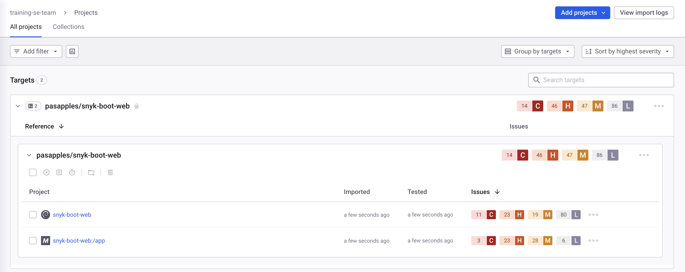

# ship-happens

## Hands on Exercise (Time : 20 Minutes)

We will create two containers as follows. Both will be pushed to DockerHub and both will then be monitored by Snyk

* base image container
* application container image

What will we need to complete this hands on exercise?

1. Dockerhub account if you want to create the image yourself
2. Snyk CLI
3. Snyk ORG ID
4. Docker Desktop
5. Snyk Account app.snyk.io 

### base image container

- The following example of taking a base Redhat image and adding some software to the image 

**./apples/Dockerfile-ubi9**

```dockerfile
FROM --platform=linux/amd64 registry.access.redhat.com/ubi9

RUN yum install -y nginx
RUN yum install -y java-1.8.0-openjdk
RUN yum install -y git
RUN yum install -y kernel-headers

RUN nginx

ENTRYPOINT ["tail", "-f", "/dev/null"]
```

- Build followed by a push to your Dockerhub account as follows. You can skip this step if you want to use what I have already created move to the next step

Note: Replace **pasapples** with your Dockerhub handle

```shell
$ docker build -f ./Dockerfile-ubi9 --tag=pasapples/simple-base-image:latest .
$ docker push pasapples/simple-base-image
```

- Now using snyk let's monitor this image as follows

```shell
$ snyk container monitor --org=03c51a7e-3c0b-4852-812d-829b4e71a186 --project-name=simple-base-image pasapples/simple-base-image:latest
```

- Snyk App Result Images


- What you will notice is snyk has shown which vulnerabilities exist in which context either Base image or User Instructions 


### application container image

- The following example is using a public Docker Image as the base image and then layering the application components required to run the app as follows

./apples/Dockerfile-snyk-boot-web

```dockerfile
FROM --platform=linux/amd64 openjdk:11.0.13-slim-buster

RUN addgroup --system javauser && adduser --system --home /home/javauser --ingroup javauser javauser
RUN mkdir /app
RUN chown -R javauser:javauser /app

ARG JAR_FILE=snyk-boot-web-0.0.1-SNAPSHOT.jar
COPY ${JAR_FILE} /app/snyk-boot-web-0.0.1-SNAPSHOT.jar

WORKDIR /app
USER javauser

ENTRYPOINT ["java","-jar","/app/snyk-boot-web-0.0.1-SNAPSHOT.jar"]
```

- This app has already been pushed to my Public DockerHub account, so we can just monitor it as follows

```shell
snyk container monitor --org=03c51a7e-3c0b-4852-812d-829b4e71a186 --project-name=snyk-boot-web pasapples/snyk-boot-web:v1
```

- Snyk App Result Images



From the image below you will see something quite different I will describe why once everyone is completed


## Run this app locally:
```
npm install
npm start
```
## To containerise this app:\
Open Dockerfile\
Use `npm install` to install dependencies\
Expose port 3000\
Run the app using `npm start`

<hr />

Suganthi Krishnavathi [suganthi.krishnavathi at snyk.io] is a Staff Solutions Engineer at Snyk <br />
Pas Apicella [pas at snyk.io] is a Principal Solution Engineer APJ at Snyk